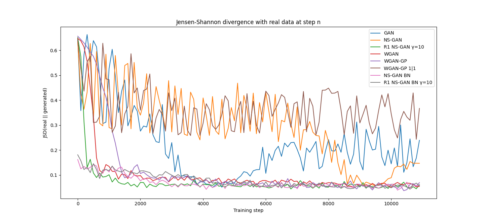

# GAN Comparison
A project for assessing GAN algorithm performance on simple 1D and 2D datasets.
Contains the following algorithms:

## Running
Install the requirements using `pip install -r requirements.txt`. I recommend you to use a venv for this.
Then edit `evaluate_algorithms.py` (or the 2D version) and run it with `python evaluate_algorithms.py`.

## Models
### GAN
The original Generative Adversarial Networks algorithm proposed in [the GAN paper](https://arxiv.org/abs/1406.2661).
It introduces a Generator (G) and Discriminator (D) network that play a "game" against each other.
D tries to predict which samples are real and which samples are generated by G, meanwhile G tries to produce samples such that D perceives them as real.

_Training on a 1D dataset consisting of 2 gaussians:_

https://user-images.githubusercontent.com/3409739/152033279-c8a0e653-0d61-49d7-8581-1699e80ac764.mp4

### NS-GAN
GAN with non-saturating loss, also introduced in [the GAN paper](https://arxiv.org/abs/1406.2661).
NS-GAN has a slight alteration in the loss function which should allow for better gradients.

_Training on a 1D dataset consisting of 2 gaussians:_

https://user-images.githubusercontent.com/3409739/152033322-32f1c0a2-55e2-44da-9607-893bf648dc82.mp4

### WGAN
[The Wasserstein GAN](https://arxiv.org/abs/1701.07875) aims to improve training stability, get rid of mode collapse, and produces interpretable loss functions.
The improvement lies in a different loss function, the Earth Mover (EM) distance. 
In order for this to work, D has to be a K-Lipschitz function. This limits the rate of change the function can have.
To show empirically that this can work, the authors propose a hacky way of enforcing this constraint: weight clipping.

_Training on a 1D dataset consisting of 2 gaussians:_

https://user-images.githubusercontent.com/3409739/152033352-251e62f9-f810-4fe2-a511-453be578289a.mp4

### WGAN-GP
Since weight clipping is a bit of a hacky and roundabout way of enforcing this constraint, 
the authors of [WGAN-GP](https://arxiv.org/abs/1704.00028) propose a better alternative: a gradient penalty.
This gradient penalty is a regularization term that is added to the WGAN loss for D and it aims to enforce a 1-Lipschitz constraint.
The term is calculated by taking a random linear interpolation of a real and a fake sample as input of D and then
penalizing D the further the L2 norm of the gradients at this sample are from 1. 

NOTE: In my implementation the loss only applies on numbers gradient L2 norms than 1.
The WGAN-GP paper notes that making the loss also apply "downwards" to numbers less than one is better in their experiments,
but it seems that for toy problems like mine this effect is reversed.

_Training on a 1D dataset consisting of 2 gaussians:_

https://user-images.githubusercontent.com/3409739/152033388-50b0264b-ad61-49e3-9f8a-18b5a88aa49d.mp4

### NS-GAN with R1 regularization
In ["Which Training Methods for GANs do actually Converge?"](https://arxiv.org/abs/1801.04406) the authors show that the 
training methods named above may in certain scenarios not converge. 
To solve this they propose 2 other gradient penalties, R1 and R2 regularization.
Both R1 and R2 "force" the gradients to 0, but R1 does so for "real" samples as input of D and R2 for "fake".
In this repository I have implemented the R1 version and applied it to an otherwise normal NS-GAN.

_Training on a 1D dataset consisting of 2 gaussians:_

https://user-images.githubusercontent.com/3409739/152033416-1894590c-5cd3-49c4-a582-d6dde403fd72.mp4

## Jensen-Shannon Divergence
In order to compare these algorithms I also implemented a discrete computation of the Jensen-Shannon divergence,
which can be used to measure the difference between two probability distributions. 
My implementation separates the space into N bins and then computes the JSD discretely.

_JSD plot for the experiments of the videos above, lower is better:_

